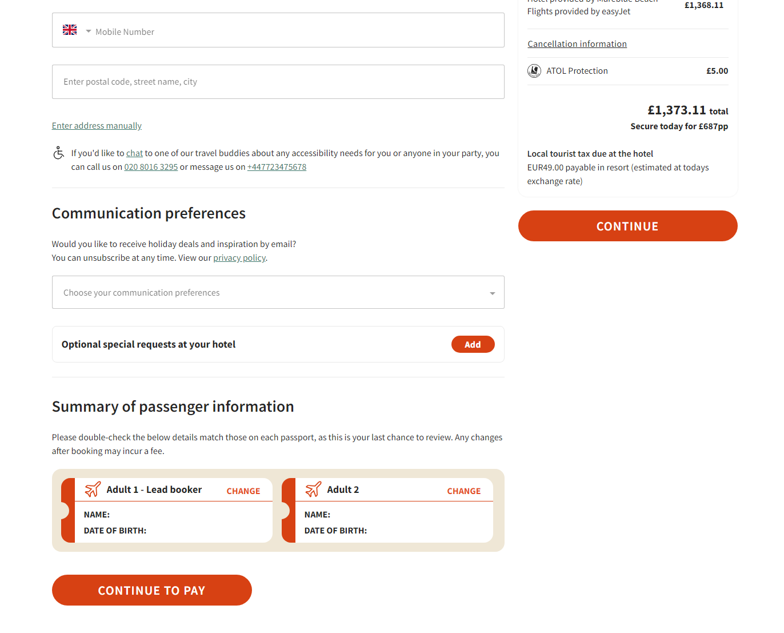

# E-Commerce dataLayer for GA4. Measurement Plan
| Event Name | Explanation | 
| ---------- | ----------- | 
| view_item_list  | To measure how often item details are viewed, send a view_item event whenever a user views an item’s details screen. |
| view_item  | To measure how often item details are viewed, send a view_item event whenever a user views an item’s details screen. |
| add_to_cart| To measure when someone adds merchandise to their shopping cart as a conversion. |
| begin_checkout  | Measure the first step in a checkout process by sending a begin_checkout event with one or more items defined with the relevant fields. A coupon can also be added at this stage to the entire order by adding it to the event or applied to a particular item by adding it to specific elements in the items array. | 
| add_shipping_info | When a user proceeds to the next step in the checkout process, shipping information is added. | 
| add_payment_info  | Send the add_payment_info event when a user submits their payment information. If applicable, include payment_type with this event for the chosen payment method. |
| Purchase | Measure a purchase by sending a purchase event with one or more items defined with the relevant fields. The same approach may be used for all events. Documentation in the references section. |


# DataLayer Implementation


### Screenshot - view_item_list - tag should be executed after user complited search action in service with parametrs in the datalayer:


### view_item_list
```html 
dataLayer.push({
   event: "view_item_list",
   ecommerce: {
      item_list_name: "Search", // how item list was generated
      item_list_id: "s.3duz.4.m1orodl5", // list_id
      items: [
         {
            index: 0, // item position
            item_id: "LGW-CFU", // city - city
            item_name: "GB-GR", // country - country
            affiliation: "", // if applicable
            currency: "GBR", // currency
            price: 887.57, // single item price
            item_brand: "Packages", // flight and hotel
            item_category: "RoundTrip", //
            item_category2: "International", // domestic or international
            item_category3: "|U2|A3|FR|", // airlines
            item_category4: "42", //comment
            item_category5: "2", // comment
            item_variant: "2|0|0|0", // 
            quantity: 1
         },
         {
            index: 1,
            item_id: "LTN-CFU",
            item_name: "GB-GR",
            affiliation: "",
            currency: "GBR",
            price: 926.58,
            item_brand: "Packages",
            item_category: "",
            item_category2: "",
            item_category3: "119610",
            item_category4: "42",
            item_category5: "2",
            item_variant: "2|0|0|0",
            quantity: 1
         }
      ]
   }
});

```

### Generate additional view_item_list when the user clicks on 'Load More'


### view_item_list
```html 
dataLayer.push({
   event: "view_item_list",
   ecommerce: {
      item_list_name: "Search", // how item list was generated
      item_list_id: "s.3duz.4.m1orodl5", // list_id
      items: [
         {
            index: 13, // item position
            item_id: "LGW-CFU", // city - city
            item_name: "GB-GR", // country - country
            affiliation: "", // if applicable
            currency: "GBR", // currency
            price: 1039.38, // single item price
            item_brand: "Packages", // flight and hotel
            item_category: "RoundTrip", //
            item_category2: "International", // domestic or international
            item_category3: "|U2|A3|FR|", // airlines
            item_category4: "42", //comment
            item_category5: "2", // comment
            item_variant: "2|0|0|0", // 
            quantity: 1
         },
         {
            index: 14,
            item_id: "LTN-CFU",
            item_name: "GB-GR",
            affiliation: "",
            currency: "GBR",
            price: 696,
            item_brand: "Packages",
            item_category: "RoundTrip",
            item_category2: "International",
            item_category3: "|U2|A3|FR|",
            item_category4: "42",
            item_category5: "2",
            item_variant: "2|0|0|0",
            quantity: 1
         }
      ]
   }
});

```


### Screenshot - view_item - tag should be executed after user clicked and loaded offer page:

### 

### view_item
```html 
dataLayer.push({
    event: "view_item",
    currency: "GBR"
    ecommerce: {
        item_list_name: "Search",
        item_list_id: "s.3duz.4.m1orodl5",
        items: [
            {
                item_id: "123213213", // hotel id - available in current implementation
                item_name: "Laguna Holiday Resort", //hotel name
                affiliation: "", // 
                currency: "GBR", // currency
                price: 498.22, // hotel price
                item_brand: "Hotel", // 
                item_category: "",
                item_category2: "",
                item_category3: "110990",
                item_category4: "42",
                item_category5: "2",
                item_variant: "2|0", // number of guests
                quantity: 1
            },
            {
                item_id: "CRF", // target place - city
                item_name: "GR", // target place - country
                affiliation: "",
                currency: "GBR", 
                price: 1575.96,
                item_brand: "Flight", 
                item_category: "RoundTrip",
                item_category2: "International",
                item_category3: "110990",
                item_category4: "42",
                item_category5: "2",
                item_variant: "2|0|0|0", // number of tickets
                quantity: 1
            }
        ]
    }
});

```


## Screenshot - add_to_cart - tag should be executed after user selected all ancillaries and clicked "Continue". Please note, final data should be updated based on selected ancillaries (transfer, luggage, car):


### add_to_cart
```html 
dataLayer.push({
  event: "add_to_cart",
  currency: "GBR"
  value: 2136.34, // sum of all ancillaries, tickets, hotel
  ecommerce: {
    items: [
      {
        item_id: "CRF",
        item_name: "GB - GR",
        affiliation: "",
        currency: "GBR",
        item_brand: "Flight",
        item_category: "MultiCity",
        item_category2: "International",
        item_category3: "U2|A3|FR", // airlines
        item_category4: "20", // comment
        item_category5: "2", // comment
        item_variant: "2|0|0|0",
        price: 576.24,
        quantity: 1
      },
      {
        item_id: "Sandy Beach Resort",
        item_name: "Sandy Beach Resort",
        affiliation: "",
        currency: "GBR",
        item_brand: "Hotel",
        item_category3: "218640", 
        item_category4: "20", 
        item_category5: "2", 
        item_category6: "4", 
        item_variant: "2|0",
        price: 1276.92,
        quantity: 1
       },
       {
        item_id: "21321321", // Seat id if applicable 
        item_name: "1C Extra legroom/exit seat", // if applicable
        affiliation: "",
        currency: "GBR",
        item_brand: "Seat",
        item_category3: ", 
        item_category4: "", 
        item_category5: "", 
        item_category6: "", 
        item_variant: "",
        price: 32.00,
        quantity: 1
       },
       {
        item_id: "2132131", // Luggage id
        item_name: "22kg Checked-in bag", // selected option - Checked-in bag|Sport equipment
        affiliation: "",
        currency: "GBR",
        item_brand: "Luggage", // if user selected additonal bags
        item_category3: "", 
        item_category4: "", 
        item_category5: "", 
        item_category6: "", 
        item_variant: "22",
        price: 162.00, // based on selection
        quantity: 1
       },
       {
        item_id: "2132131", // transfer type id
        item_name: "Shared standard shuttle", // Shared standard shuttle| Private standard car| Private premium car| Private standard minibus| Private premium minibus
        affiliation: "",
        currency: "GBR",
        item_brand: "Transfer", // if user selected transfer
        item_category3: "", 
        item_category4: "", 
        item_category5: "", 
        item_category6: "", 
        item_variant: "2|0",
        price: 20.54, // based on selection
        quantity: 1
       }.
        item_id: "2132131", // car id
        item_name: "Citroen C1, Volkswagen Up or similar - MDMRAA", // selected car
        affiliation: "",
        currency: "GBR",
        item_brand: "Car", // if user selected car
        item_category3: "", 
        item_category4: "", 
        item_category5: "", 
        item_category6: "", 
        item_variant: "2|0",
        price: 68.64, // based on selection
        quantity: 1
      
    ]
  }
});

```


### Screenshot - begin_checkout - tag should be executed when user loaded passenger info page


## begin_checkout
```html 
dataLayer.push({
  event: "begin_checkout",
    value : 2136.34,
    currency: "GBR"
    "ecommerce": {
      items: [
      {
        item_id: "CRF",
        item_name: "GB - GR",
        affiliation: "",
        currency: "GBR",
        item_brand: "Flight",
        item_category: "MultiCity",
        item_category2: "International",
        item_category3: "U2|A3|FR", // airlines
        item_category4: "20", // comment
        item_category5: "2", // comment
        item_variant: "2|0|0|0",
        price: 576.24,
        quantity: 1
      },
      {
        item_id: "Sandy Beach Resort",
        item_name: "Sandy Beach Resort",
        affiliation: "",
        currency: "GBR",
        item_brand: "Hotel",
        item_category3: "218640", 
        item_category4: "20", 
        item_category5: "2", 
        item_category6: "4", 
        item_variant: "2|0",
        price: 1276.92,
        quantity: 1
       },
       {
        item_id: "21321321", // Seat id if applicable 
        item_name: "1C Extra legroom/exit seat", // if applicable
        affiliation: "",
        currency: "GBR",
        item_brand: "Seat",
        item_category3: ", 
        item_category4: "", 
        item_category5: "", 
        item_category6: "", 
        item_variant: "",
        price: 32.00,
        quantity: 1
       },
       {
        item_id: "2132131", // Luggage id
        item_name: "22kg Checked-in bag", // selected option - Checked-in bag|Sport equipment
        affiliation: "",
        currency: "GBR",
        item_brand: "Luggage", // if user selected additonal bags
        item_category3: "", 
        item_category4: "", 
        item_category5: "", 
        item_category6: "", 
        item_variant: "22",
        price: 162.00, // based on selection
        quantity: 1
       },
       {
        item_id: "2132131", // transfer type id
        item_name: "Shared standard shuttle", // Shared standard shuttle| Private standard car| Private premium car| Private standard minibus| Private premium minibus
        affiliation: "",
        currency: "GBR",
        item_brand: "Transfer", // if user selected transfer
        item_category3: "", 
        item_category4: "", 
        item_category5: "", 
        item_category6: "", 
        item_variant: "2|0",
        price: 20.54, // based on selection
        quantity: 1
       }.
        item_id: "2132131", // car id
        item_name: "Citroen C1, Volkswagen Up or similar - MDMRAA", // selected car
        affiliation: "",
        currency: "GBR",
        item_brand: "Car", // if user selected car
        item_category3: "", 
        item_category4: "", 
        item_category5: "", 
        item_category6: "", 
        item_variant: "2|0",
        price: 68.64, // based on selection
        quantity: 1
      
    ]
   },

});
```
### Screenshot - add_shipping_info - tag should be executed when user complited passenger details section and clicked "Continue"



## add_shipping_info
```html 
dataLayer.push({
  event: "add_shipping_info",
    value : 2136.34
    "ecommerce": {
      items: [
      {
        item_id: "CRF",
        item_name: "GB - GR",
        affiliation: "",
        currency: "GBR",
        item_brand: "Flight",
        item_category: "MultiCity",
        item_category2: "International",
        item_category3: "U2|A3|FR", // airlines
        item_category4: "20", // comment
        item_category5: "2", // comment
        item_variant: "2|0|0|0",
        price: 576.24,
        quantity: 1
      },
      {
        item_id: "Sandy Beach Resort",
        item_name: "Sandy Beach Resort",
        affiliation: "",
        currency: "GBR",
        item_brand: "Hotel",
        item_category3: "218640", 
        item_category4: "20", 
        item_category5: "2", 
        item_category6: "4", 
        item_variant: "2|0",
        price: 1276.92,
        quantity: 1
       },
       {
        item_id: "21321321", // Seat id if applicable 
        item_name: "1C Extra legroom/exit seat", // if applicable
        affiliation: "",
        currency: "GBR",
        item_brand: "Seat",
        item_category3: ", 
        item_category4: "", 
        item_category5: "", 
        item_category6: "", 
        item_variant: "",
        price: 32.00,
        quantity: 1
       },
       {
        item_id: "2132131", // Luggage id
        item_name: "22kg Checked-in bag", // selected option - Checked-in bag|Sport equipment
        affiliation: "",
        currency: "GBR",
        item_brand: "Luggage", // if user selected additonal bags
        item_category3: "", 
        item_category4: "", 
        item_category5: "", 
        item_category6: "", 
        item_variant: "22",
        price: 162.00, // based on selection
        quantity: 1
       },
       {
        item_id: "2132131", // transfer type id
        item_name: "Shared standard shuttle", // Shared standard shuttle| Private standard car| Private premium car| Private standard minibus| Private premium minibus
        affiliation: "",
        currency: "GBR",
        item_brand: "Transfer", // if user selected transfer
        item_category3: "", 
        item_category4: "", 
        item_category5: "", 
        item_category6: "", 
        item_variant: "2|0",
        price: 20.54, // based on selection
        quantity: 1
       }.
        item_id: "2132131", // car id
        item_name: "Citroen C1, Volkswagen Up or similar - MDMRAA", // selected car
        affiliation: "",
        currency: "GBR",
        item_brand: "Car", // if user selected car
        item_category3: "", 
        item_category4: "", 
        item_category5: "", 
        item_category6: "", 
        item_variant: "2|0",
        price: 68.64, // based on selection
        quantity: 1
      
    ]
   },

});
```

### Screenshot - add_payment_info - tag should be executed when user complited payment detail section and clicked "Continue"


## add_payment_info
```html 
dataLayer.push({
  event: "add_shipping_info",
    value : 2136.34
    "ecommerce": {
      items: [
      {
        item_id: "CRF",
        item_name: "GB - GR",
        affiliation: "",
        currency: "GBR",
        item_brand: "Flight",
        item_category: "MultiCity",
        item_category2: "International",
        item_category3: "U2|A3|FR", // airlines
        item_category4: "20", // comment
        item_category5: "2", // comment
        item_variant: "2|0|0|0",
        price: 576.24,
        quantity: 1
      },
      {
        item_id: "Sandy Beach Resort",
        item_name: "Sandy Beach Resort",
        affiliation: "",
        currency: "GBR",
        item_brand: "Hotel",
        item_category3: "218640", 
        item_category4: "20", 
        item_category5: "2", 
        item_category6: "4", 
        item_variant: "2|0",
        price: 1276.92,
        quantity: 1
       },
       {
        item_id: "21321321", // Seat id if applicable 
        item_name: "1C Extra legroom/exit seat", // if applicable
        affiliation: "",
        currency: "GBR",
        item_brand: "Seat",
        item_category3: ", 
        item_category4: "", 
        item_category5: "", 
        item_category6: "", 
        item_variant: "",
        price: 32.00,
        quantity: 1
       },
       {
        item_id: "2132131", // Luggage id
        item_name: "22kg Checked-in bag", // selected option - Checked-in bag|Sport equipment
        affiliation: "",
        currency: "GBR",
        item_brand: "Luggage", // if user selected additonal bags
        item_category3: "", 
        item_category4: "", 
        item_category5: "", 
        item_category6: "", 
        item_variant: "22",
        price: 162.00, // based on selection
        quantity: 1
       },
       {
        item_id: "2132131", // transfer type id
        item_name: "Shared standard shuttle", // Shared standard shuttle| Private standard car| Private premium car| Private standard minibus| Private premium minibus
        affiliation: "",
        currency: "GBR",
        item_brand: "Transfer", // if user selected transfer
        item_category3: "", 
        item_category4: "", 
        item_category5: "", 
        item_category6: "", 
        item_variant: "2|0",
        price: 20.54, // based on selection
        quantity: 1
       }.
        item_id: "2132131", // car id
        item_name: "Citroen C1, Volkswagen Up or similar - MDMRAA", // selected car
        affiliation: "",
        currency: "GBR",
        item_brand: "Car", // if user selected car
        item_category3: "", 
        item_category4: "", 
        item_category5: "", 
        item_category6: "", 
        item_variant: "2|0",
        price: 68.64, // based on selection
        quantity: 1
      
    ]
   },

});
```


### Screenshot - purchase - tag should be executed from back-end when transaction was fully procced 
```html

https://www.google-analytics.com/mp/collect?measurement_id=G-XXXXXXXXXX&api_secret=YOUR_API_SECRET

{
  "client_id": "1234567890.9876543210",  // Unique identifier for the user (client)
  "events": [{
    "name": "purchase",  // Event name indicating a purchase transaction
    "params": {
      "transaction_id": "T12345", // Unique transaction ID
      "value": 2136.34, // Total value of the transaction, calculated from all items
      "currency": "GBR", // Currency used for the transaction
      "affiliation": "Online Store", // Store or channel where the purchase occurred
      "session_id": "ABCDEFGH1234567",  // Unique session ID for tracking the session
      "timestamp_micros": 1661993200000000,  // Timestamp in microseconds (example)
      "items": [
        {
          "item_id": "CRF",  // Unique ID for the flight item
          "item_name": "GB - GR",  // Name or description of the flight
          "affiliation": "",  // Affiliation, if any (optional)
          "currency": "GBR",  // Currency for this item
          "item_brand": "Flight",  // Brand category for the item (Flight)
          "item_category": "MultiCity",  // Item category (Multi-city flight)
          "item_category2": "International",  // Subcategory (International)
          "item_category3": "U2|A3|FR",  // Airlines involved
          "item_category4": "20",  // Additional category data
          "item_category5": "2",  // Additional category data
          "item_variant": "2|0|0|0",  // Variant information
          "price": 576.24,  // Price of this item
          "quantity": 1  // Quantity of this item purchased
        },
        {
          "item_id": "Sandy Beach Resort",  // Unique ID for the hotel item
          "item_name": "Sandy Beach Resort",  // Name or description of the hotel
          "affiliation": "",  // Affiliation, if any (optional)
          "currency": "GBR",  // Currency for this item
          "item_brand": "Hotel",  // Brand category for the item (Hotel)
          "item_category3": "218640",  // Hotel category ID
          "item_category4": "20",  // Additional category data
          "item_category5": "2",  // Additional category data
          "item_category6": "4",  // Additional category data
          "item_variant": "2|0",  // Variant information
          "price": 1276.92,  // Price of this item
          "quantity": 1  // Quantity of this item purchased
        },
        {
          "item_id": "21321321",  // Unique ID for the seat
          "item_name": "1C Extra legroom/exit seat",  // Name or description of the seat
          "affiliation": "",  // Affiliation, if any (optional)
          "currency": "GBR",  // Currency for this item
          "item_brand": "Seat",  // Brand category for the item (Seat)
          "price": 32.00,  // Price of this item
          "quantity": 1  // Quantity of this item purchased
        },
        {
          "item_id": "2132131",  // Unique ID for luggage
          "item_name": "22kg Checked-in bag",  // Name or description of the luggage item
          "affiliation": "",  // Affiliation, if any (optional)
          "currency": "GBR",  // Currency for this item
          "item_brand": "Luggage",  // Brand category for the item (Luggage)
          "item_variant": "22",  // Luggage weight variant (22 kg)
          "price": 162.00,  // Price of this item
          "quantity": 1  // Quantity of this item purchased
        },
        {
          "item_id": "2132131",  // Unique ID for the transfer
          "item_name": "Shared standard shuttle",  // Name or description of the transfer
          "affiliation": "",  // Affiliation, if any (optional)
          "currency": "GBR",  // Currency for this item
          "item_brand": "Transfer",  // Brand category for the item (Transfer)
          "item_variant": "2|0",  // Transfer variant information
          "price": 20.54,  // Price of this item
          "quantity": 1  // Quantity of this item purchased
        },
        {
          "item_id": "2132131",  // Unique ID for the car rental
          "item_name": "Citroen C1, Volkswagen Up or similar - MDMRAA",  // Name or description of the car
          "affiliation": "",  // Affiliation, if any (optional)
          "currency": "GBR",  // Currency for this item
          "item_brand": "Car",  // Brand category for the item (Car rental)
          "item_variant": "2|0",  // Car variant information
          "price": 68.64,  // Price of this item
          "quantity": 1  // Quantity of this item purchased
        }
      ]
    }
  }]
}


```


  
  ### Referenсes 
- [Data Layer](https://developers.google.com/tag-platform/devguides/datalayer?hl=en)
- [GA4 Events](https://developers.google.com/analytics/devguides/collection/ga4/reference/events)
- [GA4 Objects schema](https://support.google.com/analytics/answer/10119380?hl=en)
- [Google E-Commerce example Website](https://enhancedecommerce.appspot.com/)


